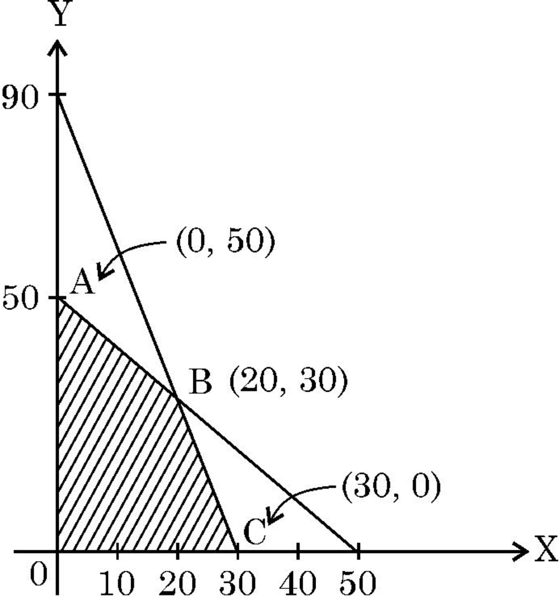

Given that \(A^{-1}=\frac{1}{7}\begin{bmatrix}2&1\\ -3&2\end{bmatrix}\), matrix A is :

(A) \(7\begin{bmatrix}2&-1\\ 3&2\end{bmatrix}\) (B) \(\begin{bmatrix}2&-1\\ 3&2\end{bmatrix}\)

(C) \(\frac{1}{7}\begin{bmatrix}2&-1\\ 3&2\end{bmatrix}\) (D) \(\frac{1}{49}\begin{bmatrix}2&-1\\ 3&2\end{bmatrix}\)

3. If A = \(\begin{bmatrix}2&1\\ -4&-2\end{bmatrix}\), then the value of \(I-A+A^{2}-A^{3}+...\) is :

(A) \(\begin{bmatrix}-1&-1\\ 4&3\end{bmatrix}\) (B) \(\begin{bmatrix}3&1\\ -4&-1\end{bmatrix}\)

(C) \(\begin{bmatrix}0&0\\ 0&0\end{bmatrix}\) (D) \(\begin{bmatrix}1&0\\ 0&1\end{bmatrix}\)

4. If A = \(\begin{bmatrix}-2&0&0\\ 1&2&3\\ 5&1&-1\end{bmatrix}\), then the value of \(\mid A\) (adj. A) \(\mid\) is :

(A) \(100\) I (B) \(10\) I (C) \(10\) (D) \(1000\)

5. Given that \(\begin{bmatrix}1&x\end{bmatrix}\begin{bmatrix}4&0\\ -2&0\end{bmatrix}=0\), the value of \(x\) is :

(A) \(-4\) (B) \(-2\) (C) \(2\) (D) \(4\)

6. Derivative of \(e^{2x}\) with respect to \(e^{x}\), is :

(A) \(e^{x}\) (B) \(2e^{x}\) (C) \(2e^{2x}\) (D) \(2e^{3x}\)

**Figure 5**: \(A\) (A) \(e^{x}\) (B) \(2e^{x}\) (C) \(2e^{2The maximum value of Z = 4\(x\) + y for a L.

P.P. whose feasible region is given below is :

17. The probability distribution of a random variable X is :

\begin{tabular}{|l|c|c|c|c|c|} \hline
**X** & 0 & 1 & 2 & 3 & 4 \\ \hline
**P(X)** & 0.1 & k & 2k & k & 0.1 \\ \hline \end{tabular}

where k is some unknown constant.

The probability that the random variable X takes the value 2 is :

\begin{tabular}{l l l l} (A) & \(\frac{1}{5}\) & (B) & \(\frac{2}{5}\) \\ (C) & \(\frac{4}{5}\) & (D) & 1 \\ \end{tabular}

18. The function f(_x_) = k_x_ - sin \(x\) is strictly increasing for

\begin{tabular}{l l l} (A) & k > 1 & (B) & k < 1 \\ (C) & k > -1 & (D) & k < -1 \\ \end{tabular}

**65/4/1/21/QSS4R** & _Page 11 of 24_